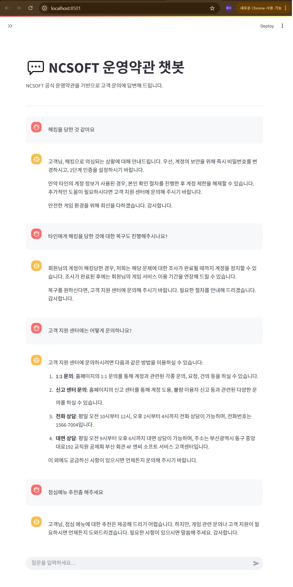

# 정책 문서 기반 고객 불만 자동 분류 & 대응 챗봇
## - (NCSOFT 운영약관 적용)



> 정책 문서 기반으로 고객 문의에 답변해 드리는 RAG(Chat + FAISS) 챗봇입니다. NCSOFT 공식 운영약관 문서를 넣어 프로젝트를 진행했습니다. 정책 문서파일과 헤더 텍스트의 내용을 수정하면 다양하게 사용 가능합니다.
> 서비스와 관련없는 질문을 할 때엔 답변이 어렵다는 말이 나오도록 프롬프트 작성되어 있습니다.

## 서비스 개요

### 1. NCSOFT 운영약관 기반 자동 상담  
NCSOFT 공식 운영약관(.txt/.pdf)을 벡터화하여 RAG(Retrieval-Augmented Generation) 방식으로 고객 문의에 정확한 답변을 제공합니다.  
- 사용자가 운영약관 관련 질문을 입력하면, 챗봇이 정책 문서를 검색하여 적절한 답변을 생성  
- 약관에 명시된 내용만 바탕으로 답변하며, 불확실한 정보는 “정중한 안내”로 처리  

### 2. Streamlit UI  
카카오톡·GPT 스타일의 채팅 인터페이스 구현 
- 실시간 대화형 메시지 표시  
- 긴 대화 시 스크롤 지원  
- 사용자/챗봇 메시지 별도 스타일 적용  

---

## 주요 기능

| 기능                        | 설명                                                         |
|----------------------------|--------------------------------------------------------------|
| 문서 기반 Q&A              | `policy_docs/` 폴더 내 운영약관(.txt, .pdf) 문서 검색 및 응답   |
| RAG 체인                   | FAISS 인덱스 + OpenAI Embeddings + ChatOpenAI + Memory 활용 |
| 시스템 프롬프트            | “약관에 명시된 내용만 답변” 등 챗봇 동작 지침 임베딩           |
| 캐시 및 인덱스 자동 갱신   | 문서 변경 시 해시 기반 인덱스 자동 재생성                    |
| 개발자 전용 설정           | 코드 상단 TEMPERATURE, N_CANDIDATES, RETRIEVE_K 등 변수 조정  |

---

## 프로젝트 수행 기간  
2025.08.01 ~ 2025.08.10

---

## 실행 및 설치

```bash
# 1. 저장소 클론
git clone https://github.com/yourusername/ncsoft-terms-chatbot.git
cd ncsoft-terms-chatbot

# 2. 가상환경 생성 & 활성화 (Anaconda 예시)
conda create -n chatbot_env python=3.10 -y
conda activate chatbot_env

# 3. 의존성 설치
pip install -r requirements.txt

# 4. 앱 실행
streamlit run chatbot_app.py
```
---

## 프로젝트 구조

```bash
.
├── chatbot_app.py           # Streamlit 웹앱 메인 스크립트
├── policy_docs/             # 운영약관(.txt, .pdf) 저장 폴더
├── faiss_index_<hash>/      # 자동 생성되는 FAISS 인덱스 디렉터리
├── .env                     # 환경 변수(API 키) 설정 파일
├── requirements.txt         # Python 패키지 의존성 목록
├── README.md                # 프로젝트 설명 문서
└── 화면.png                 # UI 스크린샷 예시 이미지
```
---

## 유의사항
OPENAI API KEY가 없는 경우 발급 후 .env 파일 생성해야 작동됩니다.
cmd 창에서 바로 생성 [echo "OPENAI_API_KEY=your_api_key" > .env]

policy_docs/ 폴더에 최신 운영약관 문서를 반드시 추가 후 실행하세요.

FAISS 인덱스는 폴더 해시가 변경될 때마다 자동으로 재생성되므로,
인덱스 디렉터리가 누적되는 경우 수동으로 삭제할 수 있습니다.
